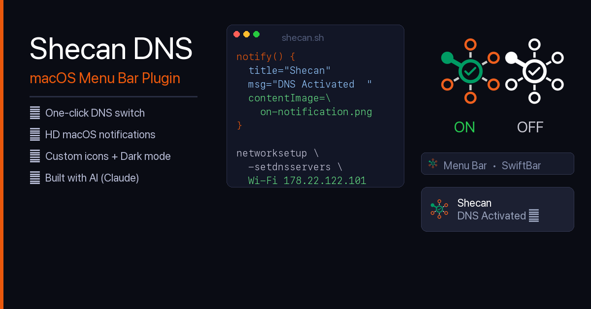
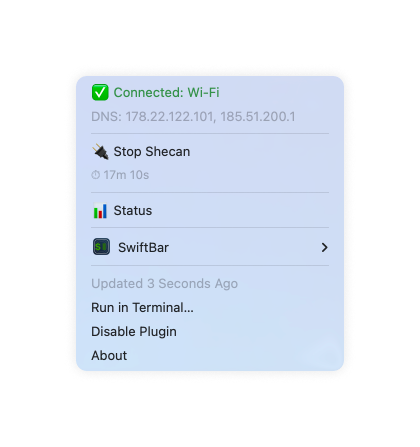

# Shecan DNS — macOS Menu Bar Plugin

A [SwiftBar](https://github.com/swiftbar/SwiftBar) plugin to toggle [Shecan](https://shecan.ir) DNS on/off with one click from your macOS menu bar.



## اسکرین‌شات



## Features

- **One-click toggle** — enable or disable Shecan DNS directly from the menu bar
- **Auto-detects** active network interface (Wi-Fi, Ethernet, etc.)
- **HD notifications** — macOS notification with custom icon on start/stop
- **Dark mode ready** — separate icons for on/off states
- **DNS backup** — restores your previous DNS on stop

## Requirements

- macOS 12+
- [SwiftBar](https://github.com/swiftbar/SwiftBar)
- `terminal-notifier` (optional, for richer notifications): `brew install terminal-notifier`

## Install

```bash
git clone https://github.com/YOUR_USERNAME/shecan-swiftbar.git
cd shecan-swiftbar
chmod +x install.sh
./install.sh
```

Then refresh SwiftBar — the Shecan icon will appear in your menu bar.

## Usage

**Menu bar:**
- Click the icon to open the menu
- **Start Shecan** — sets DNS to Shecan servers
- **Stop Shecan** — restores your previous DNS

**CLI:**
```bash
shecan start    # activate Shecan DNS
shecan stop     # restore previous DNS
shecan status   # show current DNS
```

## DDNS (Optional)

If you have a Shecan DDNS password, `install.sh` will ask for it during setup and save it to `~/.shecan_config`:

```bash
DDNS_PASSWORD=your_password
```

You can also set it manually at any time:

```bash
echo 'DDNS_PASSWORD=your_password' > ~/.shecan_config
chmod 600 ~/.shecan_config
```

This file is never committed to git.

## File Structure

```
.
├── shecan              # CLI script → /usr/local/bin/shecan
├── shecan.10s.sh       # SwiftBar plugin (refreshes every 10s)
├── shecan-action.sh    # Helper called by SwiftBar buttons
├── install.sh          # Installer
└── icons/
    ├── on-small.png          # Menu bar icon (active)
    ├── off-white.png         # Menu bar icon (inactive)
    ├── on-notification.png   # Notification icon (active)
    └── off-notification.png  # Notification icon (inactive)
```

## Built With

- Bash / Zsh
- [SwiftBar](https://github.com/swiftbar/SwiftBar)
- Python + Pillow (icon processing)
- Claude AI
